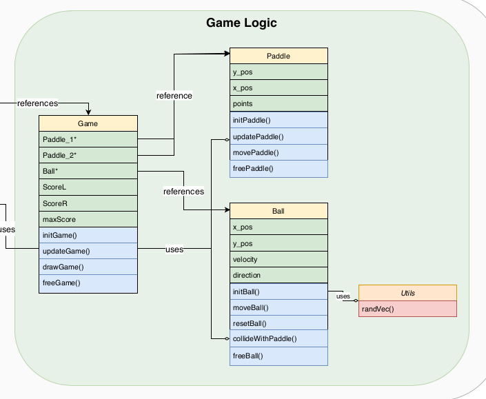

# ncurses-pong

Simple pong game developed in C using the ncurses library.  

# Documentation  
The goal of this project was to create a simple pong game in C using a pseudo-object-oriented design. The game doesn't function entirely like a regular pong game due to the reduced resolution of the display-grid.  
  
Here are some _design decisions_ that were made in order to make the game playable in a reduced resolution environment:  
- When the ball hits the board it bounces off in a random direction in order to avoid infinite loops  
- The AI is simplified, i.e. it isn't perfect in order to make the game a bit funner (a perfect AI was boring to play against)  
- The AI can only see two frames into the future  
- The game pauses for a second when a point is scored in order to show that the score was updated  
- The screen size is fixed to the initial size of the terminal it was launched in (not adaptable)  
  
## Class diagram   
Here is a figure describing the general structure of the program:  
   

Note that the project was initially designed to run on a Cyclone V SoC board, whose architecture was cut out from the diagram.  
  
## Running the game  
Since the game was developed in C, you will need to have gcc and ncurses installed on your machine (both usually come packaged with most Linux distributions). Once that is assured you can run the game simply with the following commands:  
```  
cd src  
make game   
./game   
```  


